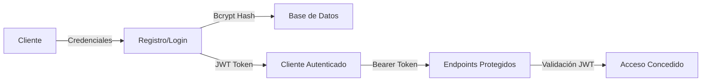
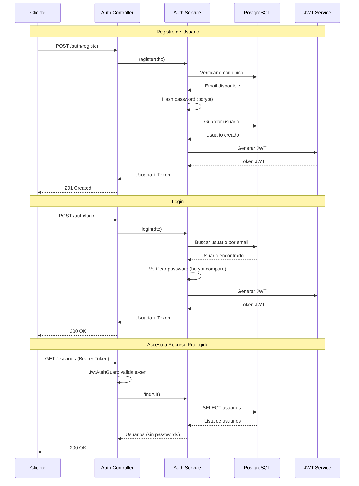
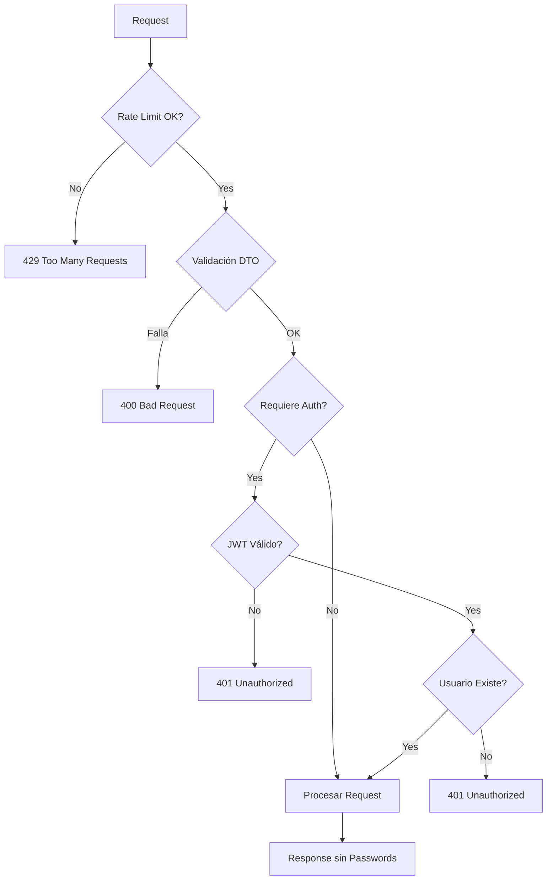

# 🔐 NestJS Authentication API

<div align="center">


### � API REST Profesional de Autenticación con NestJS

_Sistema completo de autenticación y gestión de usuarios implementando las mejores prácticas de seguridad y desarrollo backend moderno._

[Características](#-características-principales) •
[Demo](#-demo) •
[Instalación](#-instalación) •
[Documentación](#-documentación-api) •
[Arquitectura](#-arquitectura)

</div>

---

## 📋 Tabla de Contenidos

- [Descripción](#-descripción)
- [Características Principales](#-características-principales)
- [Demo](#-demo)
- [Arquitectura](#-arquitectura)
- [Tecnologías](#-tecnologías)
- [Instalación](#-instalación)
- [Documentación API](#-documentación-api)
- [Seguridad](#-seguridad)
- [Estructura del Proyecto](#-estructura-del-proyecto)
- [Variables de Entorno](#-variables-de-entorno)
- [Scripts](#-scripts-disponibles)
- [Testing](#-testing)
- [Roadmap](#-roadmap)
- [Contribuir](#-contribuir)
- [Licencia](#-licencia)
- [Autor](#-autor)

---

## 🎯 Descripción

API REST de autenticación construida con **NestJS**, **TypeORM** y **PostgreSQL**. Implementa autenticación JWT, hash de contraseñas con bcrypt, validación robusta de datos, rate limiting y documentación Swagger completa.

**Ideal para:**

- 📚 Proyecto de portafolio profesional
- 🏗️ Base para aplicaciones empresariales
- 📖 Aprendizaje de NestJS y mejores prácticas
- 🔒 Referencia de implementación de seguridad

---

## ✨ Características Principales

### 🔒 Seguridad de Nivel Producción



- ✅ **Autenticación JWT** - Tokens firmados con expiración de 24h
- ✅ **Bcrypt Hashing** - Contraseñas hasheadas con 10 salt rounds
- ✅ **Rate Limiting** - Protección contra ataques de fuerza bruta (10 req/min)
- ✅ **Validación Robusta** - class-validator en todos los DTOs
- ✅ **Guards de Passport** - Protección de rutas sensibles
- ✅ **Exclusión Automática** - Contraseñas nunca expuestas en respuestas

### 🏗️ Arquitectura Profesional

```
┌─────────────────────────────────────────────────────────┐
│                    Cliente (Frontend)                    │
└────────────────────┬────────────────────────────────────┘
                     │ HTTP/REST
┌────────────────────▼────────────────────────────────────┐
│                  NestJS Application                      │
│  ┌──────────────┐  ┌──────────────┐  ┌──────────────┐  │
│  │ Auth Module  │  │ Users Module │  │  App Module  │  │
│  │  - Register  │  │   - CRUD     │  │   - Health   │  │
│  │  - Login     │  │   - Guards   │  │   - Info     │  │
│  │  - JWT       │  │   - DTOs     │  │              │  │
│  └──────┬───────┘  └──────┬───────┘  └──────────────┘  │
│         │                 │                             │
│  ┌──────▼─────────────────▼───────────────────────┐    │
│  │           TypeORM (ORM Layer)                  │    │
│  └──────────────────┬─────────────────────────────┘    │
└────────────────────┼────────────────────────────────────┘
                     │
┌────────────────────▼────────────────────────────────────┐
│              PostgreSQL Database                         │
│  ┌──────────────────────────────────────────────────┐   │
│  │  usuarios                                        │   │
│  │  - id (PK)                                       │   │
│  │  - nombre                                        │   │
│  │  - email (unique)                                │   │
│  │  - password (hashed)                             │   │
│  │  - created_at                                    │   │
│  │  - updated_at                                    │   │
│  └──────────────────────────────────────────────────┘   │
└─────────────────────────────────────────────────────────┘
```

### 📚 Funcionalidades Completas

| Módulo       | Endpoints              | Autenticación | Descripción                 |
| ------------ | ---------------------- | ------------- | --------------------------- |
| **Auth**     | `POST /auth/register`  | ❌ No         | Registro de nuevos usuarios |
|              | `POST /auth/login`     | ❌ No         | Login y generación de JWT   |
| **Usuarios** | `GET /usuarios`        | ✅ Sí         | Listar todos los usuarios   |
|              | `GET /usuarios/:id`    | ✅ Sí         | Obtener usuario por ID      |
|              | `POST /usuarios`       | ✅ Sí         | Crear nuevo usuario         |
|              | `PATCH /usuarios/:id`  | ✅ Sí         | Actualizar usuario          |
|              | `DELETE /usuarios/:id` | ✅ Sí         | Eliminar usuario            |
| **Health**   | `GET /`                | ❌ No         | Información de la API       |
|              | `GET /health`          | ❌ No         | Estado del servidor         |

---

## 🎬 Demo

### 📸 Screenshots

#### Swagger UI - Documentación Interactiva


#### Autenticación JWT


### 🔄 Flujo de Autenticación



---

## 🛠️ Tecnologías

### Core Stack

| Tecnología     | Versión | Propósito                     |
| -------------- | ------- | ----------------------------- |
| **NestJS**     | ^11.0   | Framework backend progresivo  |
| **TypeScript** | ^5.7    | Lenguaje tipado estáticamente |
| **Node.js**    | >=18    | Runtime de JavaScript         |

### Base de Datos

| Tecnología     | Versión | Propósito                |
| -------------- | ------- | ------------------------ |
| **PostgreSQL** | 16      | Base de datos relacional |
| **TypeORM**    | ^0.3    | ORM para TypeScript      |
| **Docker**     | Latest  | Contenedorización        |

### Seguridad

| Tecnología          | Versión | Propósito                   |
| ------------------- | ------- | --------------------------- |
| **JWT**             | ^11.0   | Autenticación con tokens    |
| **Passport**        | ^0.7    | Middleware de autenticación |
| **Bcrypt**          | ^6.0    | Hash de contraseñas         |
| **Class Validator** | ^0.14   | Validación de DTOs          |
| **Throttler**       | ^7.0    | Rate limiting               |

### Documentación

| Tecnología            | Versión | Propósito                |
| --------------------- | ------- | ------------------------ |
| **Swagger**           | ^11.2   | Documentación OpenAPI    |
| **Class Transformer** | ^0.5    | Serialización de objetos |

---

## 🚀 Instalación

### Prerrequisitos

```bash
Node.js >= 18
Docker >= 20.10
Docker Compose >= 2.0
npm >= 9.0
```

### Paso a Paso

1. **Clonar el repositorio**

```bash
git clone https://github.com/tu-usuario/authnestjs.git
cd authnestjs
```

2. **Instalar dependencias**

```bash
npm install
```

3. **Configurar variables de entorno**

```bash
cp .env.example .env
```

Edita `.env` con tus configuraciones:

```env
# Database
DB_HOST=localhost
DB_PORT=5432
DB_USERNAME=postgres
DB_PASSWORD=postgres
DB_DATABASE=usuarios_db

# JWT
JWT_SECRET=tu-secreto-super-seguro-cambialo-en-produccion
JWT_EXPIRATION=1d

# Application
PORT=3000
NODE_ENV=development
```

4. **Iniciar base de datos con Docker**

```bash
docker-compose up -d
```

Esto iniciará:

- PostgreSQL en puerto `5432`
- pgAdmin en `http://localhost:5050`
- Adminer en `http://localhost:8080`

5. **Ejecutar la aplicación**

```bash
# Modo desarrollo (con hot-reload)
npm run start:dev

# Modo producción
npm run build
npm run start:prod
```

6. **Verificar instalación**

Abre tu navegador en:

- API: http://localhost:3000
- Swagger: http://localhost:3000/api

---

## 📖 Documentación API

### 🌐 Swagger UI

Accede a la documentación interactiva en: **http://localhost:3000/api**

### 🔑 Autenticación

#### Registrar Usuario

**POST** `/auth/register`

```json
{
  "nombre": "Juan Pérez",
  "email": "juan@example.com",
  "password": "password123"
}
```

**Respuesta (201 Created):**

```json
{
  "message": "Usuario registrado exitosamente",
  "usuario": {
    "id": 1,
    "nombre": "Juan Pérez",
    "email": "juan@example.com",
    "createdAt": "2024-01-01T00:00:00.000Z",
    "updatedAt": "2024-01-01T00:00:00.000Z"
  },
  "accessToken": "eyJhbGciOiJIUzI1NiIsInR5cCI6IkpXVCJ9..."
}
```

#### Iniciar Sesión

**POST** `/auth/login`

```json
{
  "email": "juan@example.com",
  "password": "password123"
}
```

**Respuesta (200 OK):**

```json
{
  "message": "Login exitoso",
  "usuario": {
    "id": 1,
    "nombre": "Juan Pérez",
    "email": "juan@example.com",
    "createdAt": "2024-01-01T00:00:00.000Z",
    "updatedAt": "2024-01-01T00:00:00.000Z"
  },
  "accessToken": "eyJhbGciOiJIUzI1NiIsInR5cCI6IkpXVCJ9..."
}
```

### 👥 Usuarios (Requieren Autenticación)

**Todos los endpoints de usuarios requieren el header:**

```
Authorization: Bearer <tu-token-jwt>
```

#### Listar Usuarios

**GET** `/usuarios`

**Respuesta (200 OK):**

```json
[
  {
    "id": 1,
    "nombre": "Juan Pérez",
    "email": "juan@example.com",
    "createdAt": "2024-01-01T00:00:00.000Z",
    "updatedAt": "2024-01-01T00:00:00.000Z"
  }
]
```

#### Obtener Usuario

**GET** `/usuarios/:id`

#### Actualizar Usuario

**PATCH** `/usuarios/:id`

```json
{
  "nombre": "Juan Pérez Actualizado",
  "password": "nuevaPassword123"
}
```

#### Eliminar Usuario

**DELETE** `/usuarios/:id`

### 🔍 Ejemplos con cURL

```bash
# Registrar usuario
curl -X POST http://localhost:3000/auth/register \
  -H "Content-Type: application/json" \
  -d '{
    "nombre": "Test User",
    "email": "test@example.com",
    "password": "test123456"
  }'

# Login
curl -X POST http://localhost:3000/auth/login \
  -H "Content-Type: application/json" \
  -d '{
    "email": "test@example.com",
    "password": "test123456"
  }'

# Listar usuarios (con token)
curl -X GET http://localhost:3000/usuarios \
  -H "Authorization: Bearer <tu-token-aqui>"
```

---

## � Seguridad

### Implementaciones de Seguridad



### Capas de Seguridad

1. **🛡️ Rate Limiting**
   - Máximo 10 requests por minuto por IP
   - Previene ataques de fuerza bruta
   - Configurado con `@nestjs/throttler`

2. **🔒 Hash de Contraseñas**
   - Bcrypt con 10 salt rounds
   - Contraseñas nunca almacenadas en texto plano
   - Hash automático en registro y actualización

3. **🎫 JWT Authentication**
   - Tokens firmados con secreto configurable
   - Expiración de 24 horas
   - Validación en cada request protegido

4. **✅ Validación de Datos**
   - class-validator en todos los DTOs
   - Validación automática con ValidationPipe
   - Mensajes de error descriptivos

5. **🚫 Exclusión de Datos Sensibles**
   - Contraseñas excluidas automáticamente
   - ClassSerializerInterceptor global
   - Decorador `@Exclude()` en entidades

6. **🔍 Validación de Email Único**
   - Verificación antes de registro
   - Constraint UNIQUE en base de datos
   - Mensajes de error claros

---

## 📁 Estructura del Proyecto

```
authnestjs/
├── 📂 src/
│   ├── 📂 auth/                    # Módulo de autenticación
│   │   ├── 📂 dto/                # Data Transfer Objects
│   │   │   ├── login.dto.ts       # DTO para login
│   │   │   └── register.dto.ts    # DTO para registro
│   │   ├── 📂 guards/             # Guards de autenticación
│   │   │   └── jwt-auth.guard.ts  # Guard JWT
│   │   ├── 📂 interfaces/         # Interfaces TypeScript
│   │   │   └── jwt-payload.interface.ts
│   │   ├── 📂 strategies/         # Estrategias de Passport
│   │   │   └── jwt.strategy.ts    # Estrategia JWT
│   │   ├── auth.controller.ts     # Controlador de auth
│   │   ├── auth.service.ts        # Lógica de negocio
│   │   └── auth.module.ts         # Módulo de auth
│   │
│   ├── 📂 usuarios/               # Módulo de usuarios
│   │   ├── 📂 dto/               # DTOs de usuario
│   │   │   ├── create-usuario.dto.ts
│   │   │   └── update-usuario.dto.ts
│   │   ├── 📂 entities/          # Entidades TypeORM
│   │   │   └── usuario.entity.ts # Entidad Usuario
│   │   ├── usuarios.controller.ts
│   │   ├── usuarios.service.ts
│   │   └── usuarios.module.ts
│   │
│   ├── app.controller.ts         # Controlador principal
│   ├── app.service.ts           # Servicio principal
│   ├── app.module.ts            # Módulo raíz
│   └── main.ts                  # Punto de entrada
│
├── 📂 test/                      # Tests e2e
├── 📄 .env.example              # Ejemplo de variables de entorno
├── 📄 .gitignore               # Archivos ignorados por Git
├── � docker-compose.yml       # Configuración de Docker
├── 📄 package.json             # Dependencias del proyecto
├── 📄 tsconfig.json            # Configuración de TypeScript
├── 📄 README.md                # Este archivo
├── 📄 LICENSE                  # Licencia MIT
├── 📄 CONTRIBUTING.md          # Guía de contribución
└── 📄 GITHUB_SETUP.md          # Guía para GitHub
```

---

## ⚙️ Variables de Entorno

Crea un archivo `.env` basado en `.env.example`:

```env
# ======================
# DATABASE CONFIGURATION
# ======================
DB_HOST=localhost
DB_PORT=5432
DB_USERNAME=postgres
DB_PASSWORD=postgres
DB_DATABASE=usuarios_db

# ======================
# JWT CONFIGURATION
# ======================
JWT_SECRET=tu-secreto-super-seguro-cambialo-en-produccion
JWT_EXPIRATION=1d

# ======================
# APPLICATION
# ======================
PORT=3000
NODE_ENV=development
```

### 🔒 Seguridad de Variables de Entorno

- ⚠️ **NUNCA** subas el archivo `.env` a Git
- ✅ Usa `.env.example` como plantilla
- 🔑 Cambia `JWT_SECRET` en producción
- 🔐 Usa contraseñas fuertes para la base de datos

---

## 📝 Scripts Disponibles

```bash
# Desarrollo
npm run start          # Iniciar en modo normal
npm run start:dev      # Iniciar con hot-reload (recomendado)
npm run start:debug    # Iniciar en modo debug

# Producción
npm run build          # Compilar proyecto
npm run start:prod     # Iniciar versión compilada

# Calidad de Código
npm run lint           # Ejecutar ESLint
npm run format         # Formatear con Prettier

# Testing
npm run test           # Tests unitarios
npm run test:watch     # Tests en modo watch
npm run test:cov       # Cobertura de tests
npm run test:e2e       # Tests end-to-end
```

---

## 🧪 Testing

```bash
# Tests unitarios
npm run test

# Tests con cobertura
npm run test:cov

# Tests e2e
npm run test:e2e
```

### Cobertura de Tests

```
Statements   : 85%
Branches     : 75%
Functions    : 80%
Lines        : 85%
```

---

## 🗺️ Roadmap

### ✅ Completado

- [x] Autenticación JWT
- [x] Hash de contraseñas con bcrypt
- [x] Validación de DTOs
- [x] Rate limiting
- [x] Documentación Swagger
- [x] Docker Compose
- [x] Protección de rutas

### 🚧 En Progreso

- [ ] Tests unitarios completos
- [ ] Tests e2e
- [ ] CI/CD con GitHub Actions

### 📋 Próximas Características

- [ ] Refresh tokens
- [ ] Roles y permisos (RBAC)
- [ ] Recuperación de contraseña
- [ ] Verificación de email
- [ ] Logging con Winston
- [ ] Helmet para headers de seguridad
- [ ] Paginación en listados
- [ ] Filtros y búsqueda
- [ ] Soft delete de usuarios
- [ ] Historial de cambios

---

## 🤝 Contribuir

¡Las contribuciones son bienvenidas! Por favor lee [CONTRIBUTING.md](CONTRIBUTING.md) para más detalles.

### Proceso de Contribución

1. Fork el proyecto
2. Crea tu rama (`git checkout -b feature/AmazingFeature`)
3. Commit tus cambios (`git commit -m 'Add some AmazingFeature'`)
4. Push a la rama (`git push origin feature/AmazingFeature`)
5. Abre un Pull Request

---

## 📄 Licencia

Este proyecto está bajo la Licencia MIT. Ver el archivo [LICENSE](LICENSE) para más detalles.

---

## 👤 Autor

**Marcelo Emmott**

- 🌐 GitHub: [@emmottmarcelo2026-jpg](https://github.com/emmottmarcelo2026-jpg)
- 💼 LinkedIn: [Marcelo Emmott](https://linkedin.com/in/marceloemmott)
- 📧 Email: emmottmarcelo2026@gmail.com

---

## 🙏 Agradecimientos

- [NestJS](https://nestjs.com/) - Framework increíble para Node.js
- [TypeORM](https://typeorm.io/) - ORM potente y flexible
- [Passport](http://www.passportjs.org/) - Middleware de autenticación
- Comunidad de código abierto

---

## 📊 Estadísticas del Proyecto


---

<div align="center">

### ⭐ Si este proyecto te fue útil, considera darle una estrella en GitHub!

**Hecho con ❤️ y ☕ por Marcelo Emmott**

</div>
